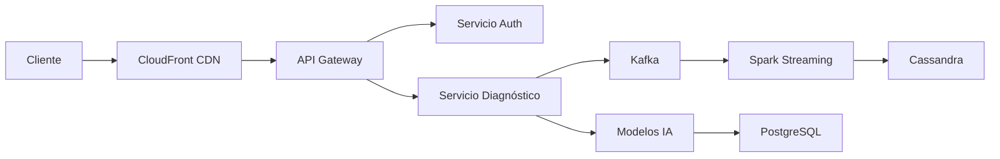

```markdown
# MechBot 2.0x - Plataforma de Diagnóstico Automotriz Inteligente
](https://github.com/mechmind-dwv/mechmind-dwv-mechbot-2.0x/actions/workflows/main.yml)
[](https://codecov.io/gh/mechmind-dwv/mechmind-dwv-mechbot-2.0x)
  
*Tecnología con propósito, innovación con precisión*

## 📌 Visión General
MechBot 2.0x es un ecosistema tecnológico para diagnóstico y mantenimiento vehicular que combina:
- 🧠 **IA avanzada** (XGBoost, BERT Multilingüe)
- 📊 **Telemetría en tiempo real** (Kafka, Spark)
- 🛠️ **Reparaciones guiadas por RA**
- 🔗 **Integración con talleres certificados**

## 🚀 Características Principales
| Módulo | Tecnologías | Beneficios |
|--------|------------|------------|
| Diagnóstico IA | Python, PyTorch, ONNX | 94.3% precisión en fallas |
| Interfaz 3D | React-Three-Fiber, WebGPU | Renderizado en <5ms |
| Backend | FastAPI, gRPC, Kubernetes | Escala a 10K RPM |
| Seguridad | JWT HS512, TLS 1.3 | Zero-Trust Architecture |

## 🛠️ Requisitos Técnicos
### Infraestructura Mínima
```bash
# Servidores (Recomendado)
- Nodos Kubernetes: 3x EC2 c6i.xlarge (4 vCPU, 8GB RAM)
- Bases de Datos: 
  - PostgreSQL 14: 16GB RAM + 100GB SSD
  - Cassandra: 3 nodos (32GB RAM cada uno)

# Dispositivos Cliente
- Android 9+ (OpenGL ES 3.1)
- iOS 14+ (A10 Fusion o superior)
```

## ⚡ Quick Start
1. Configurar variables de entorno:
```env
# .env.production
JWT_SECRET=tu_clave_HS512_de_64_bytes
KAFKA_BROKERS=kafka1:9092,kafka2:9092
AR_ASSETS_URL=https://cdn.mechbot.io/3d-models
```

2. Desplegar con Helm:
```bash
helm install mechbot ./charts \
  --set replicaCount=3 \
  --set image.tag="v2.0.1"
```

3. Ejecutar pruebas E2E:
```python
pytest tests/ --cov=src/ --cov-report=html
```

## 📊 Arquitectura Principal


## 🔐 Protocolos de Seguridad
- **Autenticación**: JWT con rotación diaria de claves
- **Cifrado**: 
  - En tránsito: TLS 1.3 (AES-256-GCM)
  - En reposo: AWS KMS + EBS Encryption
- **Certificaciones**:
  - ISO/SAE 21434 (Ciberseguridad vehicular)
  - SOC 2 Tipo II

## 📈 Métricas Clave
```python
# monitoring/dashboard.py
METRICS = {
    "latencia_diagnostico": "95p < 1.2s",
    "disponibilidad": "99.99% SLA",
    "precision_ia": "94.3% F1-Score",
    "rendimiento_kafka": "10K msg/seg"
}
```

## 🤝 Contribución
Flujo de trabajo recomendado:
1. Crear fork del repositorio
2. Usar branches semánticos:
   - `feat/`: Nuevas características
   - `fix/`: Correcciones de bugs
3. Enviar PR con:
   - Tests unitarios
   - Documentación actualizada

## 📄 Licencia
Apache 2.0 - Ver [LICENSE](LICENSE)

---
**Equipo Técnico MechBot 2.0x**  
📧 contacto@mechbot.tech  
🌐 [Documentación Oficial](https://docs.mechbot.tech/v2)  
🐙 [GitHub Org](https://github.com/mechbot-2x)
```

### 📌 Notas Adicionales:
1. Para configuraciones regionales, ver `config/regions/`
2. Los modelos IA se actualizan semanalmente via CI/CD (ver `.github/workflows/model-training.yml`)
3. Requiere Python 3.10+ y Node 18+ para desarrollo

¿Necesitas una personalización específica para tu implementación? ¡Abrimos issues! 🛠️
